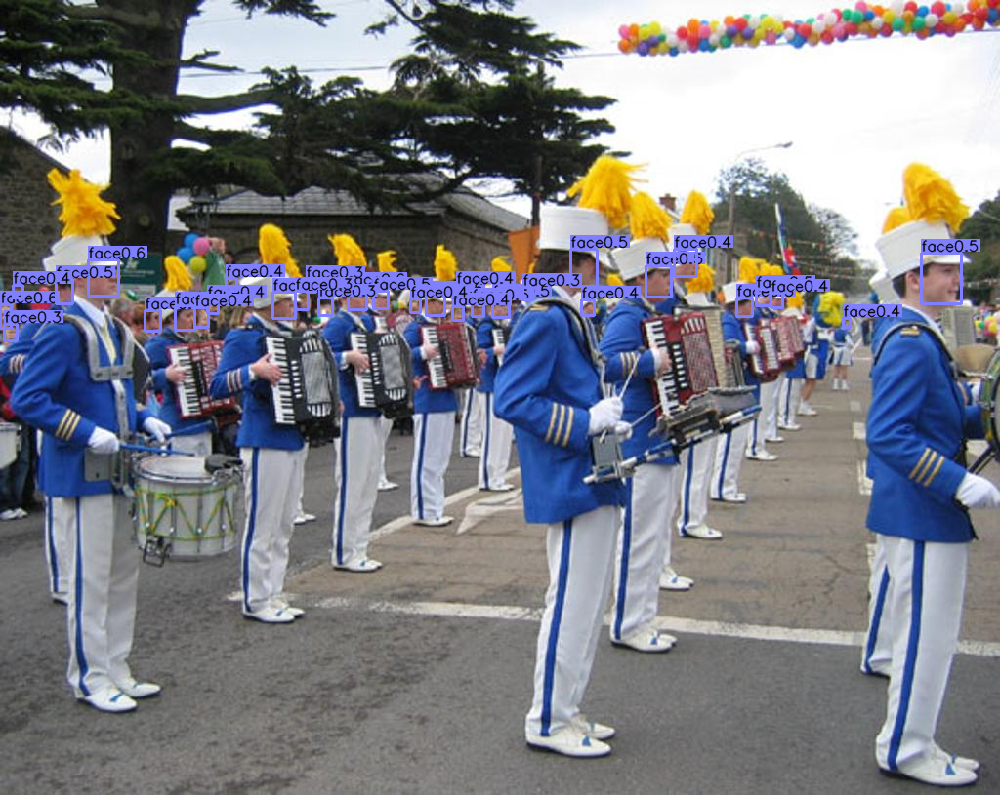

# centernet-train-wider-face

This is a practice about Centernet(https://github.com/xingyizhou/CenterNet)

Put demo_wider_face.py on src/ ,
Put ctdet_wider_dla.pth on models/

"python demo_wider_face.py ctdet --demo webcam --load_model ../models/ctdet_wider_dla.pth "

  

